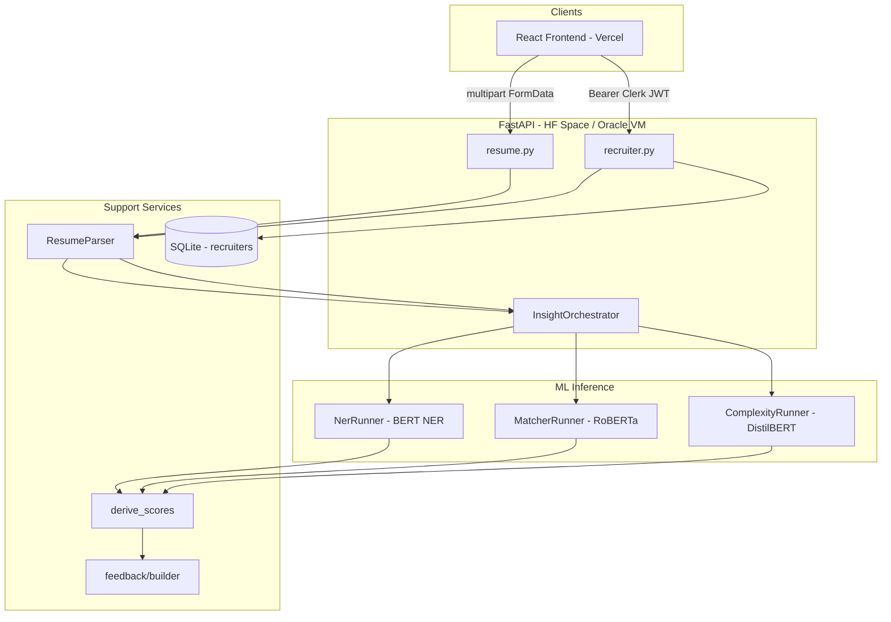

# InSightATS Backend — Complete Interview Guide

> **Source of truth:** The live backend is deployed as a [Hugging Face Space](https://huggingface.co/spaces/Suvradip01/insightats-backend). ML weights live in a separate repo: [Suvradip01/insightats-models](https://huggingface.co/Suvradip01/insightats-models).  
> In this monorepo, `backend/` and `insightats-backend/` are **gitignored** (local copies only). This document describes the **deployed** backend exactly as it exists on HF.

---

## Table of Contents

1. [What the backend does](#1-what-the-backend-does)
2. [High-level architecture](#2-high-level-architecture)
3. [Tech stack and why each piece exists](#3-tech-stack-and-why-each-piece-exists)
4. [Repository layout (every file)](#4-repository-layout-every-file)
5. [Application entry and HTTP layer](#5-application-entry-and-http-layer)
6. [Configuration (`app/core`)](#6-configuration-appcore)
7. [API schemas (`app/schemas`)](#7-api-schemas-appschemas)
8. [API endpoints (`app/api/endpoints`)](#8-api-endpoints-appapiendpoints)
9. [Resume parsing](#9-resume-parsing)
10. [ML pipeline — M1, M2, M3](#10-ml-pipeline--m1-m2-m3)
11. [Scoring engine (`derive_scores`)](#11-scoring-engine-derive_scores)
12. [Feedback builder](#12-feedback-builder)
13. [Orchestrator (end-to-end flow)](#13-orchestrator-end-to-end-flow)
14. [Recruiter auth and storage](#14-recruiter-auth-and-storage)
15. [Environment variables and deployment](#15-environment-variables-and-deployment)
16. [API contracts (request/response)](#16-api-contracts-requestresponse)
17. [Interview talking points](#17-interview-talking-points)

---

## 1. What the backend does

**InSightATS** is an AI-powered resume–job-description matching API. It:

| Feature | Endpoint | Who uses it |
|--------|----------|-------------|
| **Single resume analysis** | `POST /api/v1/resume/analyze` | Job seekers (React dashboard, Clerk optional on frontend) |
| **Batch ranking for recruiters** | `POST /api/v1/recruiter/batch-analyze` | Recruiters (Clerk JWT + company header) |
| **Legacy recruiter login** | `POST /api/v1/recruiter/login`, `/register` | Still in code; production UI uses **Clerk** instead |
| **Health checks** | `GET /`, `/health`, `/ready` | Load balancers, HF Space, ops |

For each resume + job description, the backend:

1. Extracts plain text from PDF/DOCX/TXT.
2. Runs **three ML models** (or heuristics when weights are missing):
   - **M1 (NER):** BERT token classification → structured entities (name, skills, companies, …).
   - **M2 (Matcher):** RoBERTa sequence classification → semantic fit (No / Partial / Strong Fit).
   - **M3 (Complexity):** DistilBERT-style classifier → project portfolio depth (Basic / Intermediate / Advanced).
3. **Derives four radar scores** (0–100): Skills, Experience, Projects, Structure.
4. **Blends** M2 fit + radar into one **headline score** (0–100).
5. Returns **human-readable feedback** strings aligned with the frontend’s `parseFeedback()` logic.

---

## 2. High-level architecture



**Design choices worth explaining in interviews:**

- **Lazy singleton orchestrator:** Models (~1.14 GB total) load on first `analyze`, not at import — faster cold start for `/health`.
- **Pure scoring functions:** `derive_scores.py` has no ML deps → unit-testable (`test_score.py`).
- **Models in separate HF repo:** Space repo stays under 1 GB; Docker downloads weights at build time.
- **CPU PyTorch in production:** HF free tier / Oracle Always Free have no GPU; `requirements.txt` pins `torch==2.5.1+cpu`.

---

## 3. Tech stack and why each piece exists

| Dependency | Role | Why not something else? |
|------------|------|---------------------------|
| **FastAPI** | HTTP API, validation, OpenAPI | Async file upload, Pydantic v2, fast to ship |
| **Uvicorn** | ASGI server | Standard for FastAPI; `run.py` configures port/workers |
| **Pydantic** | Request/response models | Type-safe API contract shared with frontend expectations |
| **Transformers + PyTorch** | Load fine-tuned BERT/RoBERTa/DistilBERT | You trained custom heads; HF ecosystem fits |
| **safetensors** | Weight format | Safer/faster than raw `.bin`; loaders scan for `*.safetensors` |
| **pdfplumber** | PDF text extraction | Pure Python; needs **poppler** in Docker (`poppler-utils`) |
| **python-docx** | DOCX paragraphs | Standard for Word resumes |
| **python-multipart** | `File` + `Form` uploads | Required for `UploadFile` in FastAPI |
| **SQLite** | Recruiter accounts/sessions | Lightweight; legacy path before Clerk |
| **SHAP** (optional) | Token attributions for M2 | Off by default (`ENABLE_SHAP=0`) — ~60s per request |

---

## 4. Repository layout (every file)

```
insightats-backend/          # HF Space root
├── Dockerfile               # HF Docker Space: install deps, download models, run API
├── requirements.txt         # Python pins (CPU torch, transformers, etc.)
├── run.py                   # Uvicorn entrypoint
├── test_score.py            # Unit test for headline score math
├── .env.example             # Documented env vars for Oracle/local
├── db.sqlite3               # Bundled on HF (ephemeral on free tier sleep)
├── README.md                # HF Space metadata (short)
└── app/
    ├── __init__.py          # Empty package marker
    ├── main.py              # FastAPI app, CORS, routers, health
    ├── core/
    │   └── config.py        # Settings singleton from env
    ├── api/endpoints/
    │   ├── resume.py        # POST /analyze
    │   └── recruiter.py     # register, login, batch-analyze
    ├── schemas/
    │   ├── analyze.py       # AnalyzeResponse + nested ML outputs
    │   ├── batch.py         # BatchAnalyzeResponse
    │   ├── job.py           # JobDescription
    │   └── recruiter.py     # Auth DTOs
    └── services/
        ├── constants.py     # NER labels, matcher class names
        ├── resume_parser.py # PDF/DOCX/TXT → text
        ├── feedback/
        │   ├── __init__.py
        │   └── builder.py   # feedback[] strings for UI
        ├── inference/
        │   ├── __init__.py
        │   ├── ner.py       # M1
        │   ├── matcher.py   # M2 + optional SHAP
        │   └── complexity.py# M3 + heuristics
        ├── pipeline/
        │   ├── __init__.py
        │   └── orchestrator.py  # Wires M1→M2→M3→scores→feedback
        ├── scoring/
        │   ├── __init__.py  # Re-exports derive_scores
        │   └── derive_scores.py
        └── recruiter/
            ├── security.py  # PBKDF2 passwords, tokens
            └── store.py     # SQLite CRUD
```

**Model directories** (not in git; downloaded at runtime):

```
models/   # MODEL_DIR env, default /app/models on HF
├── ner_model/          # M1 weights + tokenizer
├── matcher_model/      # M2 + optional thresholds.json
└── complexity_model/   # M3 (optional; heuristics if missing)
```

---

## 5. Application entry and HTTP layer

### `run.py`

| Responsibility | Detail |
|----------------|--------|
| **Starts Uvicorn** | Imports `app.main:app` |
| **Port** | `PORT` env, default **7860** on HF, **8000** in `.env.example` for Oracle |
| **Workers** | `WEB_CONCURRENCY`, default **1** — models are in-process singletons |
| **Reload** | Only if `APP_ENV=development` |

**Why needed:** HF Spaces and Docker expect a single `CMD`; separating `run.py` keeps `main.py` importable for tests.

---

### `app/main.py`

Creates `FastAPI` with title/version from settings.

| Route | Function | Purpose |
|-------|----------|---------|
| `GET /` | `root()` | Welcome JSON — quick sanity check |
| `GET /health` | `health()` | **Liveness** — process up, no model check |
| `GET /ready` | `ready()` | **Readiness** — `_orchestrator` instantiated (models attempted) |
| Routers | `include_router` | `/api/v1/resume/*`, `/api/v1/recruiter/*` |

**CORS middleware:**

- `allow_origins=settings.ALLOWED_ORIGINS` — comma-separated from env in production (Vercel URL).
- `allow_credentials=True`, `allow_methods/headers=["*"]` — browser preflight for Clerk + custom `X-Company-Name`.

**Why `/ready` matters:** Orchestrator loads transformers on first use; during deploy, LB can wait until `models_loaded: true` before sending traffic.

---

## 6. Configuration (`app/core`)

### `app/core/config.py`

**Class `Settings`** (instantiated as module-level `settings`):

| Setting | Env var | Default | Why |
|---------|---------|---------|-----|
| `PROJECT_NAME` | — | `"InSightATS API"` | OpenAPI title |
| `VERSION` | — | `"1.0.0"` | Health responses |
| `DB_PATH` | `DB_PATH` | `{repo}/db.sqlite3` | SQLite file path; `/data/db.sqlite3` on persistent VM |
| `NER_MODEL_DIR` | `MODEL_DIR` | `{repo}/models/ner_model` | M1 path |
| `MATCHER_MODEL_DIR` | `MODEL_DIR` | `.../matcher_model` | M2 path |
| `COMPLEXITY_MODEL_DIR` | `MODEL_DIR` | `.../complexity_model` | M3 path |
| `ENABLE_SHAP` | `ENABLE_SHAP` | `False` | Expensive explainability |
| `ALLOWED_ORIGINS` | `ALLOWED_ORIGINS` | localhost:5173, etc. | CORS for Vite + production |

**Helpers:**

- `_env_bool(name, default)` — parses `1/true/yes/on`.
- `_env_list(name, default)` — splits comma-separated origins.

**Interview angle:** Centralized config avoids scattering `os.getenv`; paths use `_BASE` so imports work regardless of cwd.

---

## 7. API schemas (`app/schemas`)

Pydantic models define the **contract** the React app consumes.

### `job.py` — `JobDescription`

```python
title: str
description: str
mandatory_skills: List[str] = []
preferred_skills: List[str] = []
```

**Why:** JD can be plain text only (dashboard sends `title` + `description`) or enriched with explicit skill lists for stricter matching.

---

### `analyze.py` — Full analysis response

**Nested models:**

| Model | Fields | Meaning |
|-------|--------|---------|
| `NerEntities` | name, email, skills[], designation, degree, college_name, companies[], location, yoe, grad_year | M1 output normalized for API |
| `BreakdownProbs` | p_no_fit, p_partial, p_strong | Raw softmax from M2 |
| `SkillSignals` | match[], exp_gap | Matched JD skills + years short of requirement |
| `FitResult` | label, verdict, fit_score (0–1), breakdown, skill_signals, domain_override | M2 (+ synthetic if matcher down) |
| `Confidence3` | basic, intermediate, advanced | M3 class probabilities |
| `ShapKeywords` | advanced[], intermediate[], basic[] | Placeholder buckets for UI/XAI |
| `ProjectComplexity` | level, confidence, shap_keywords, plain_explanation | M3 output |

**`AnalyzeResponse` (main payload):**

| Field | Type | Frontend use |
|-------|------|----------------|
| `status` | str | `"success"`, `"pending_setup"`, `"error"` |
| `message` | Optional[str] | Error/setup hints |
| `score` | int 0–100 | Pie chart headline |
| `skill_score`, `experience_score`, `project_score`, `structure_score` | int 0–100 | Radar chart axes |
| `feedback` | List[str] | Cards in Dashboard (parsed by emoji/markdown patterns) |
| `missing_skills` | List[str] | Badges on experience card |
| `ner_entities`, `fit_result`, `project_complexity` | nested | Recruiter dashboard sub-scores |
| `shap_feedback`, `raw_shap_data` | optional | Future XAI / debugging |

---

### `batch.py`

- `RankedResumeResult`: filename, rank, score, ranking_reason, full `analysis`.
- `BatchAnalyzeResponse`: status, message, total, results[].

**Why separate schema:** Recruiter view needs ordering metadata; reuses `AnalyzeResponse` to avoid duplication.

---

### `recruiter.py`

- `RecruiterRegisterRequest` / `RecruiterLoginRequest` — company, username, password validation.
- `RecruiterAuthResponse` — `token`, `token_type: "bearer"`.

---

## 8. API endpoints (`app/api/endpoints`)

### `resume.py` — `POST /api/v1/resume/analyze`

**Handler:** `analyze_resume(resume_file, job_description)`

| Step | What happens |
|------|----------------|
| 1 | `await resume_file.read()` → bytes |
| 2 | `ResumeParser.extract_text(content, filename)` |
| 3 | `json.loads(job_description)` → `JobDescription(**job_dict)` |
| 4 | `get_orchestrator().analyze(text, job)` |
| 5 | Return `AnalyzeResponse` (including `pending_setup` if no models) |

**Errors:**

- `400` — bad JSON, unsupported file, empty text (`ValueError`).
- `500` — unexpected exceptions (logged as `detail` string).

**Auth:** None on this route (public analyze for candidates; frontend may still gate UI with Clerk).

**Multipart fields (must match frontend `Dashboard.jsx`):**

- `resume_file` — File
- `job_description` — Form string, JSON: `{"title":"Target Role","description":"..."}`

---

### `recruiter.py`

#### `POST /register` & `POST /login` (legacy)

- Hash password with PBKDF2 (`security.hash_password`).
- SQLite `create_recruiter` / `get_recruiter_by_username`.
- Return session token via `create_session` (12h TTL).

**Note:** Production recruiter UI uses **Clerk**; these endpoints remain for backward compatibility or direct API testing.

---

#### `POST /batch-analyze` (primary recruiter flow)

**Auth:** `Depends(_require_recruiter)`

**`_require_recruiter(request, creds)`:**

1. Requires `Authorization: Bearer <JWT>`.
2. **Does not call Clerk API** — decodes JWT payload (middle segment, base64url) to read `sub` and email.
3. Reads `X-Company-Name` header (frontend sends `user.unsafeMetadata.company`).
4. Returns `AuthPrincipal(recruiter_id=0, company=..., username=email)`.

**Why decode locally:** Stateless verification on HF; **production hardening** would verify JWT signature with Clerk JWKS (mention this in interviews).

**Handler flow:**

1. Parse JD file → `JobDescription(title="Target Role", description=jd_text)`.
2. For each resume in `resumes: List[UploadFile]`:
   - Extract text → `orch.analyze(text, job)`.
   - On `ValueError`, append error-shaped `AnalyzeResponse` with score 0.
3. Sort by `score` descending.
4. Assign `rank` 1..N, build `ranking_reason` via `_ranking_reason(analysis)`.
5. Return `BatchAnalyzeResponse`.

**Multipart fields (match `recruiter-dashboard.jsx`):**

- `resumes` — multiple files, same field name
- `job_description_file` — single JD file

---

## 9. Resume parsing

### `app/services/resume_parser.py` — class `ResumeParser`

| Method | Behavior |
|--------|----------|
| `extract_text(file_content, filename)` | Routes by extension |
| `_extract_from_pdf` | `pdfplumber.open(BytesIO)` — per-page `extract_text()` |
| `_extract_from_docx` | `docx.Document` — join paragraph texts |
| TXT branch | `decode("utf-8", errors="replace")` |
| `_clean_text` | Collapse whitespace; strip non-ASCII (English-focused) |

**Why pdfplumber:** Better layout preservation than PyPDF2 for many resumes; tradeoff is **poppler** system dependency in Docker.

**Failure mode:** Raises `ValueError("Unsupported file format...")` → 400 to client.

---

## 10. ML pipeline — M1, M2, M3

### Shared pattern (all runners)

1. Look for `*.safetensors` in model folder (`_find_safetensors`).
2. If missing → `loaded = False`, warn log, fall back (synthetic fit / heuristics).
3. Load with `AutoTokenizer` + `AutoModelForTokenClassification` or `AutoModelForSequenceClassification`.
4. Device: CUDA if available else CPU (`device_id` 0 vs -1 for pipeline).

---

### M1 — `app/services/inference/ner.py` — `NerRunner`

**Model:** Fine-tuned **BERT** token classification (Hugging Face `pipeline("ner", aggregation_strategy="first")`).

**Entity groups** (from `constants.ALL_NER_ENTITY_TYPES`):

Name, Skills, Designation, Degree, College Name, Companies worked at, Years of Experience, Graduation Year, Location, Email Address, Links.

| Method | Purpose |
|--------|---------|
| `extract_grouped(resume_text)` | Runs NER on first **8000** chars; filters score ≥ 0.5; dedupes per group; regex-fills Email if missed |
| `to_contract(grouped, resume_text)` | Maps to `NerEntities`; regex fallback for YOE and graduation year |

**Why M1:** Structured signals for skill overlap, structure score, and enriching text sent to M2 (`Skills identified: ...` prefix).

---

### M2 — `app/services/inference/matcher.py` — `MatcherRunner`

**Model:** Fine-tuned **RoBERTa** 3-class classifier: `No Fit`, `Partial Fit`, `Strong Fit`.

| Method | Purpose |
|--------|---------|
| `predict_probs(resume, jd, resume_for_encoding=...)` | Tokenizes pair `truncation="longest_first", max_length=512`; softmax logits |
| `build_fit_result(...)` | Maps probs → `FitResult`; **fit_score** = `clip(0.5 * p_partial + 1.0 * p_strong, 0, 1)` |
| `shap_explain(...)` | Optional SHAP Explainer on single-sequence proxy (slow) |

**Thresholds:** Optional `matcher_model/thresholds.json` → `partial_thr`, `strong_thr` (defaults 0.18, 0.65).

**Verdict mapping:**

```text
"No Fit"      → "NOT A FIT"
"Partial Fit" → "PARTIAL FIT"
"Strong Fit"  → "STRONG FIT"
```

**Why M2:** Semantic match beyond keyword overlap; captures reworded experience vs JD.

**Encoding trick:** `resume_for_encoding` prepends extracted skills list (up to 4500 chars) so matcher sees explicit skill signal even when NER is sparse.

---

### M3 — `app/services/inference/complexity.py` — `ComplexityRunner`

**Model:** 3-class **project complexity** classifier (Basic / Intermediate / Advanced).

| Function | Purpose |
|----------|---------|
| `_project_section_block(text)` | Isolates "Projects/Portfolio" section (~4000 chars) so work-experience buzzwords don’t inflate score |
| `heuristic_complexity(text)` | Used when M3 weights missing: GitHub link, section heading, keyword counts (K8s, microservices, etc.) |
| `predict(resume_text)` | Model inference on project block, else heuristic |

**Radar mapping** (in `derive_scores.project_score_from_level`):

- Basic → **40**
- Intermediate / Medium → **70**
- Advanced → **95**

---

## 11. Scoring engine (`derive_scores`)

All functions in `app/services/scoring/derive_scores.py` are **pure** (no I/O) — ideal for unit tests and explaining logic in interviews.

### Skill discovery & matching

| Function | What it does |
|----------|----------------|
| `jd_term_found_in_resume(term, resume_text)` | Word-boundary safe match; special cases for `java` vs `javascript`, `go` vs `mongodb`, etc. |
| `infer_skills_from_resume_text(text)` | Scans `_TECH_LEXICON` when NER returns no skills |
| `expand_skill_phrases(skills)` | Splits `"Java / Spring"` into separate tokens |
| `jd_required_skills(jd, mandatory, preferred)` | Union of explicit lists + lexicon tokens found in JD |
| `compute_skill_overlap(resume_skills, jd_skills)` | Returns matched + missing lists |
| `refine_overlap_with_resume_text(...)` | Re-adds skills found in full text but missed by NER tokenization |

### Experience / YOE

| Function | What it does |
|----------|----------------|
| `extract_resume_yoe_years(text, ner_yoe)` | NER span first, else regex `(\d+) years` |
| `extract_jd_required_years(jd)` | Largest plausible year requirement in JD |
| `compute_exp_gap_years(resume_yoe, jd_required)` | `max(0, required - resume)` |

### Dimension scores (0–100)

| Function | Formula idea |
|----------|----------------|
| `structure_score_from_entities(grouped, text)` | % of 8 structure entity groups filled; **floor** from section headings (Experience, Education, …); student resume boost |
| `project_score_from_level(level)` | Basic=40, Intermediate=70, Advanced=95 |
| `derive_skill_score(matched, jd_count, fit_score)` | `100 * matched/jd_count` blended 82/18 with M2 fit |
| `derive_experience_score(yoe, jd_years, exp_gap, fit)` | Tiered score vs requirement; penalty `exp_gap * 8`; blend 72/28 with M2 |

### Headline score — `orchestrator._composite_headline_score`

```text
m2 = fit_score * 100
dim = 0.35*skill + 0.25*exp + 0.25*project + 0.15*structure
blended = 0.42*m2 + 0.58*dim
return round(clamp(blended, 0, 100))
```

**If matcher unavailable:** headline = weighted sum of four dimensions only (no 42% M2 term).

**`test_score.py`** asserts numeric examples (e.g. skills=63, exp=83, proj=40, struct=62, fit=0.9 → **62**).

---

## 12. Feedback builder

### `app/services/feedback/builder.py` — `build_feedback_lines(...)`

Produces `List[str]` tuned to **frontend regex parsers** in `Dashboard.jsx`:

| Condition | Example line |
|-----------|----------------|
| High skill score, no missing | `✅ **Skills**: All mandatory skills...` |
| Missing skills | `❌ **Critical Missing Skills**: You might be missing: ...` |
| Project level | `**Project Detected (Basic/Medium/Advanced Level)**: ...` |
| Always | `Tip for Project: Strengthen descriptions...` |
| Experience high/low | `**Experience Relevance**: ...` |
| Final | `**Overall**: {fit.label}. {shap_feedback}` |

**Why separate module:** Keeps orchestrator thin; copy changes don’t touch ML code.

---

## 13. Orchestrator (end-to-end flow)

### `app/services/pipeline/orchestrator.py`

**Class `InsightOrchestrator`:**

- `__init__`: constructs `NerRunner()`, `MatcherRunner()`, `ComplexityRunner()`.

**Method `analyze(resume_text, job) -> AnalyzeResponse`:**

```text
1. If neither NER nor Matcher loaded → return status="pending_setup"
2. M1: grouped entities → NerEntities (+ skill expansion/fallback)
3. Build jd_skills, matched/missing via refine_overlap_with_resume_text
4. Build resume_for_m2 (skills prefix + resume)
5. Compute exp_gap, SkillSignals
6. M2: build_fit_result OR _synthetic_fit if matcher down
7. Optional SHAP if ENABLE_SHAP
8. M3: complexity.predict
9. structure_score_from_entities, project_score_from_level
10. derive_skill_score, derive_experience_score
11. _composite_headline_score (or dimension-only if no matcher)
12. build_feedback_lines → AnalyzeResponse
```

**Singleton:**

```python
_orchestrator = None

def get_orchestrator() -> InsightOrchestrator:
    global _orchestrator
    if _orchestrator is None:
        _orchestrator = InsightOrchestrator()
    return _orchestrator
```

**Why lazy:** Importing `main.py` stays light; first request pays model load cost.

---

## 14. Recruiter auth and storage

### `security.py`

| Function | Purpose |
|----------|---------|
| `hash_password` | PBKDF2-HMAC-SHA256, 210k iterations, urlsafe base64 salt/hash |
| `verify_password` | Constant-time compare via `hmac.compare_digest` |
| `new_token` | `secrets.token_urlsafe(32)` for session IDs |
| `AuthPrincipal` | dataclass: recruiter_id, company, username |

**Why PBKDF2:** No bcrypt dependency; good enough for lightweight SQLite auth.

---

### `store.py`

**Tables:**

```sql
recruiters (id, company, username, password_hash, created_at, UNIQUE(company, username))
recruiter_sessions (token PK, recruiter_id FK, expires_at, created_at)
```

| Function | Purpose |
|----------|---------|
| `ensure_db` | CREATE TABLE IF NOT EXISTS |
| `create_recruiter` | INSERT |
| `get_recruiter_by_company_username` / `get_recruiter_by_username` | SELECT |
| `create_session` | INSERT token, default TTL **12 hours** |
| `get_principal_for_token` | Validate expiry, JOIN recruiter |

**Clerk path:** Batch endpoint uses JWT decode only; SQLite sessions are **not** used for Clerk users today.

---

## 15. Environment variables and deployment

### `.env.example` (summary)

| Variable | Production meaning |
|----------|-------------------|
| `APP_ENV` | `production` vs `development` (reload) |
| `PORT` | 8000 Oracle / 7860 HF |
| `DB_PATH` | Persistent volume path |
| `MODEL_DIR` | Where `ner_model`, `matcher_model`, `complexity_model` live |
| `ALLOWED_ORIGINS` | Vercel frontend URL(s) |
| `ENABLE_SHAP` | `0` default |
| `WEB_CONCURRENCY` | `1` |

### `Dockerfile` (HF Space)

1. `python:3.11-slim` + poppler for PDFs.
2. Non-root `user` (UID 1000).
3. `pip install -r requirements.txt` + `huggingface_hub`.
4. **`huggingface-cli download Suvradip01/insightats-models --local-dir /app/models`** — avoids 1 GB Space limit.
5. `ENV PORT=7860`, `DB_PATH=/app/db.sqlite3`, `MODEL_DIR=/app/models`.
6. `CMD ["python", "run.py"]`.

### Local dev (from monorepo `.gitignore` comments)

- Clone/copy `insightats-backend` to `backend/` locally.
- Place weights under `backend/models/` or set `MODEL_DIR`.
- Run: `python run.py` with `APP_ENV=development`, `PORT=8000`.
- Frontend: `VITE_API_BASE=http://127.0.0.1:8000`.

---

## 16. API contracts (request/response)

### `POST /api/v1/resume/analyze`

**Request:** `multipart/form-data`

| Field | Type | Example |
|-------|------|---------|
| `resume_file` | file | resume.pdf |
| `job_description` | string (JSON) | `{"title":"Target Role","description":"We need Python..."}` |

**Response 200:** `AnalyzeResponse` JSON (see schemas).

**Frontend mapping:** `score`, `skill_score`, `experience_score`, `project_score`, `structure_score`, `feedback[]`, `missing_skills[]`.

---

### `POST /api/v1/recruiter/batch-analyze`

**Headers:**

| Header | Value |
|--------|--------|
| `Authorization` | `Bearer <clerk_jwt>` |
| `X-Company-Name` | From Clerk `unsafeMetadata.company` |

**Request:** `multipart/form-data`

| Field | Type |
|-------|------|
| `resumes` | multiple files |
| `job_description_file` | single file (.txt/.pdf/.docx) |

**Response 200:**

```json
{
  "status": "success",
  "message": "Analyzed N resume(s) for Acme Corp.",
  "total": 3,
  "results": [
    {
      "filename": "alice.pdf",
      "rank": 1,
      "score": 78,
      "ranking_reason": "Overall score 78/100. Fit verdict: PARTIAL FIT. ...",
      "analysis": { /* full AnalyzeResponse */ }
    }
  ]
}
```

---

## 17. Interview talking points

### Elevator pitch (30 seconds)

> “InSightATS backend is a FastAPI service that parses resumes, runs three fine-tuned transformers for entity extraction, semantic JD matching, and project complexity, then fuses those signals into explainable scores and feedback. It’s deployed on Hugging Face Spaces with models in a separate repo, and exposes a public analyze API plus a Clerk-protected batch ranking API for recruiters.”

### Deep-dive questions you should be ready for

1. **Why three models instead of one LLM?**  
   Controlled latency/cost on CPU, interpretable axes (skills/exp/projects/structure), fine-tuned on your labeled data.

2. **How do you prevent false skill matches?**  
   `jd_term_found_in_resume` word boundaries; `java` vs `javascript`; refine with full resume text.

3. **What if models aren’t loaded?**  
   `pending_setup` for analyze; M3 heuristics; M2 synthetic fit from skill overlap density.

4. **How is the headline score calculated?**  
   42% M2 fit + 58% weighted radar dimensions; see `test_score.py`.

5. **Security tradeoffs?**  
   Clerk JWT decoded without signature verification in batch route — say you’d add JWKS validation in production; candidate analyze is intentionally public.

6. **Scalability bottlenecks?**  
   Single worker, in-memory models, synchronous inference per request; batch is sequential loop — would add queue/workers for high volume.

7. **Why SQLite?**  
   Legacy recruiter auth; Clerk replaced UI login but DB code remains.

8. **Deployment story?**  
   Docker on HF; models downloaded at build; CORS via `ALLOWED_ORIGINS`; health vs ready probes.

### Quick reference — all HTTP routes

| Method | Path | Auth |
|--------|------|------|
| GET | `/` | No |
| GET | `/health` | No |
| GET | `/ready` | No |
| POST | `/api/v1/resume/analyze` | No |
| POST | `/api/v1/recruiter/register` | No |
| POST | `/api/v1/recruiter/login` | No |
| POST | `/api/v1/recruiter/batch-analyze` | Bearer JWT + optional `X-Company-Name` |

---

## Appendix — Function index by file

### `derive_scores.py` (scoring)

- `_norm_skill`, `jd_term_found_in_resume`, `infer_skills_from_resume_text`, `expand_skill_phrases`
- `jd_required_skills`, `extract_resume_yoe_years`, `extract_jd_required_years`
- `_resume_token_covers_jd_term`, `compute_skill_overlap`, `refine_overlap_with_resume_text`
- `structure_score_from_entities`, `project_score_from_level`
- `derive_skill_score`, `derive_experience_score`, `compute_exp_gap_years`

### `orchestrator.py`

- `_composite_headline_score`, `_synthetic_fit`, `InsightOrchestrator.analyze`, `get_orchestrator`

### `ner.py`

- `_find_safetensors`, `_clean_word`, `NerRunner.extract_grouped`, `NerRunner.to_contract`

### `matcher.py`

- `MatcherRunner.predict_probs`, `build_fit_result`, `shap_explain`

### `complexity.py`

- `_project_section_block`, `heuristic_complexity`, `ComplexityRunner.predict`

### `recruiter.py` (endpoints)

- `_require_recruiter`, `register_recruiter`, `login_recruiter`, `_ranking_reason`, `batch_analyze`

---

*Next document (when you’re ready): **FRONTEND-INTERVIEW-GUIDE.md** — every React file, component, route, and UI flow.*
